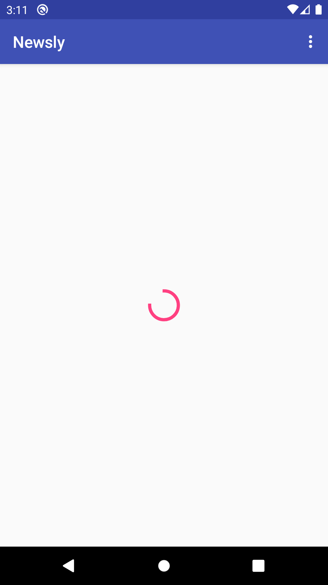
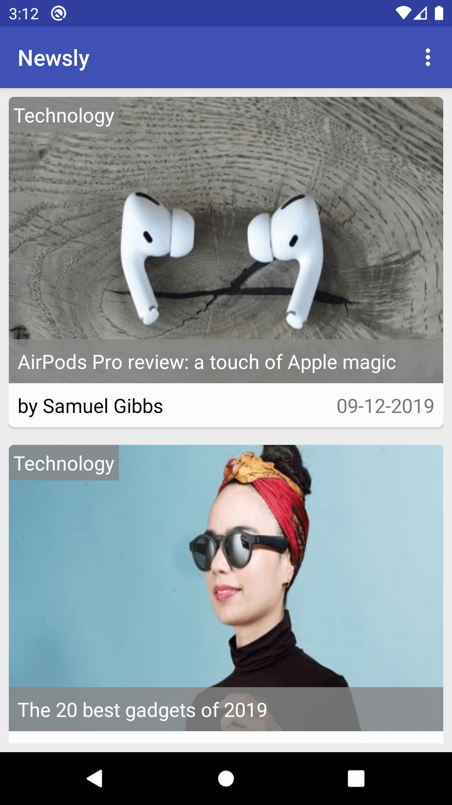
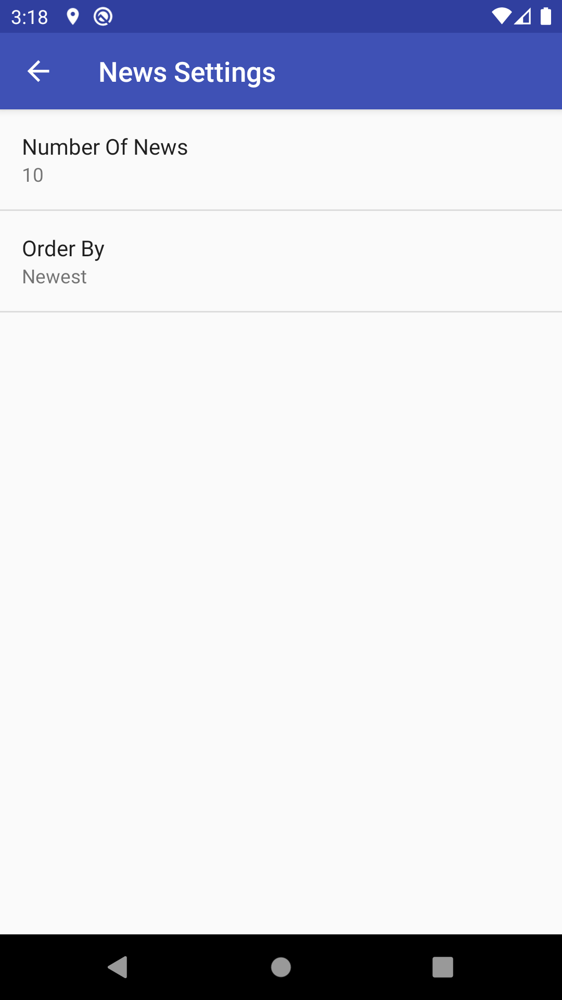
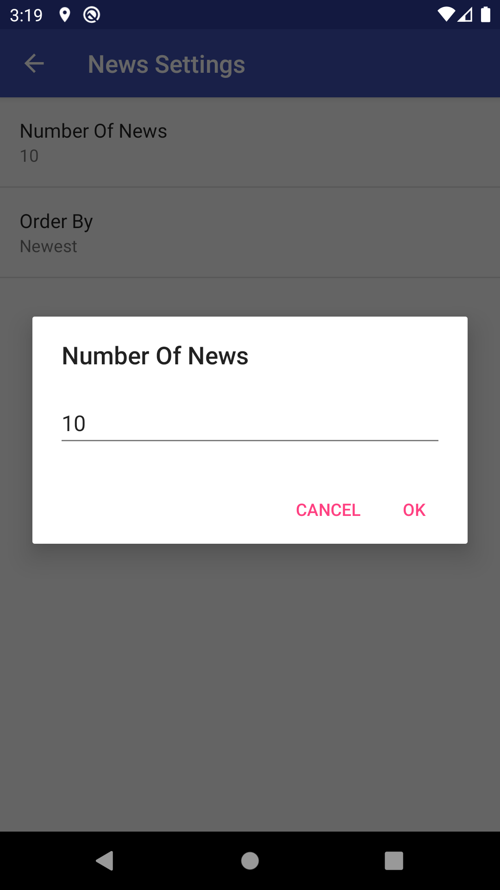
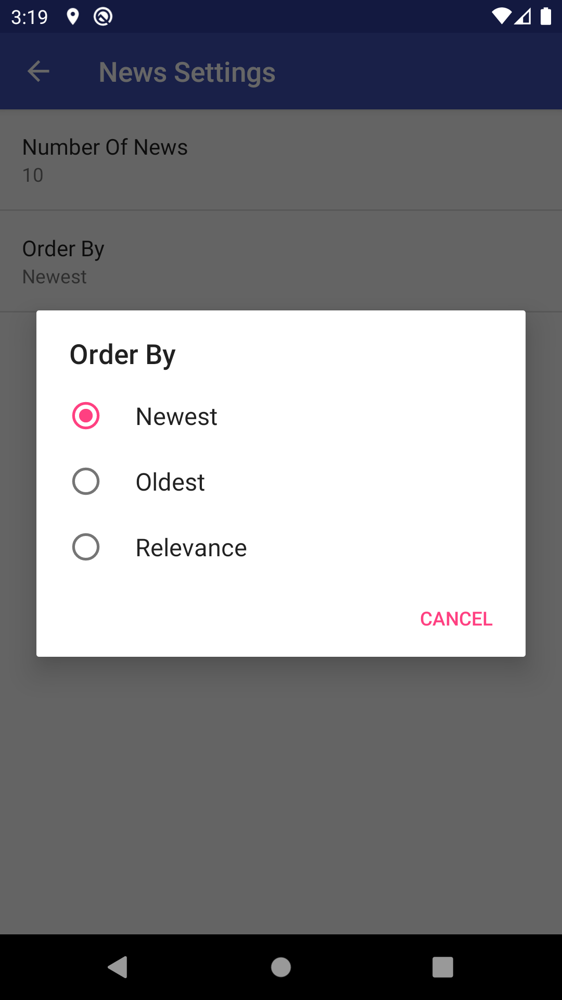

# Newsly-App-ABND-P6
Project #6 in Android Basics Nanodegree by Google

<h2>Project Requirements:</h2>

This project is 2 stage project.For stage 1, create an app to display recent news stories on a topic of your choice using an API.
In the second and final stage, add a preference screen to the News App that is already created.

<h3>Screenshot #1</h3>

<h3>Screenshot #2</h3>

<h3>Screenshot #3</h3>
/>

<h3>Screenshot #4</h3>

<h3>Screenshot #5</h3>

